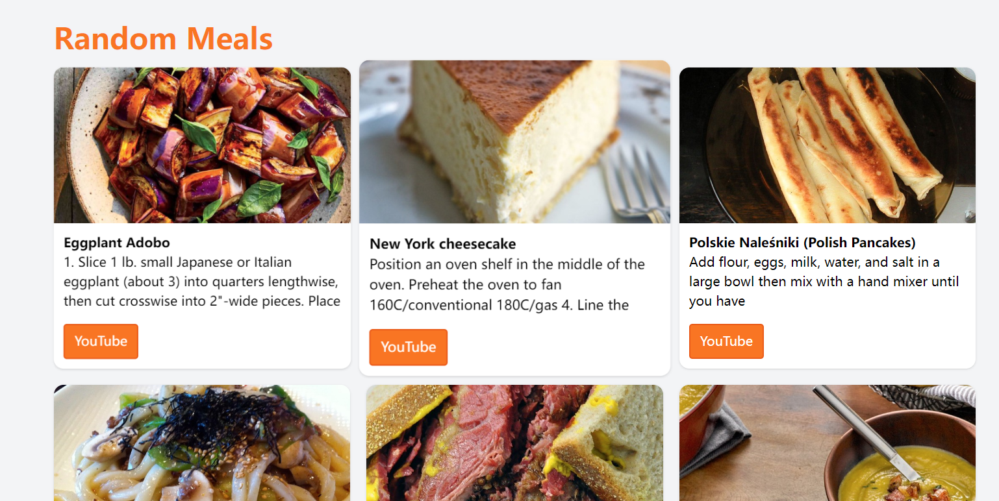
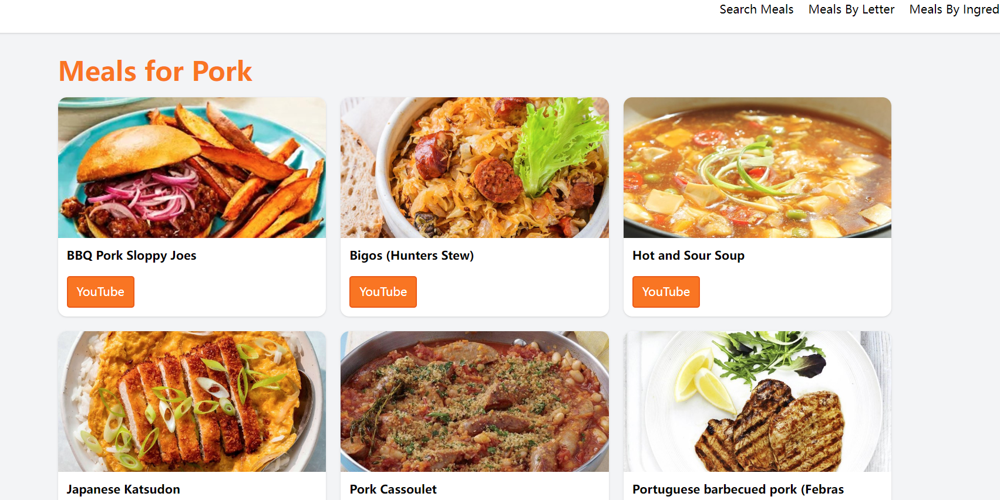
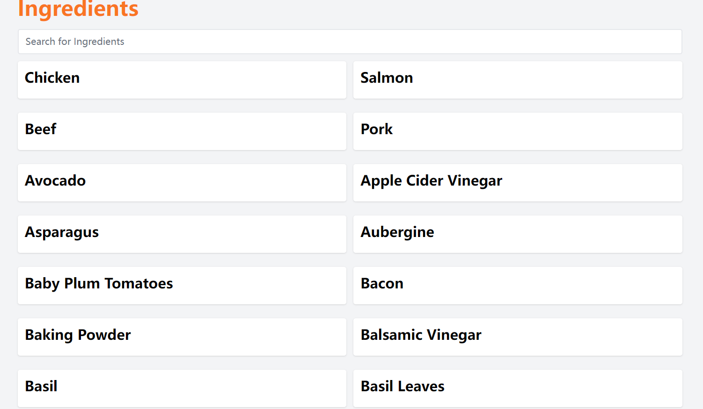

# 🥪 Vue-meals
>a simple meals use by Vue  
>its a very simple example for students  
>u can use it to achieve u final homework
---

---

---

---
### 🥞 ports
  http://localhost:5760/  
### 🥙 API
<a href="https://www.youtube.com/watch?v=cfiN8lCA3RM" style="color:blue">Click Me get API</a>
### 🍣 how to run?  
use vscode and new a terminal
input **npm run dev**
### 🥮 Toturial
[🍷 Here](https://www.youtube.com/watch?v=cfiN8lCA3RM)
